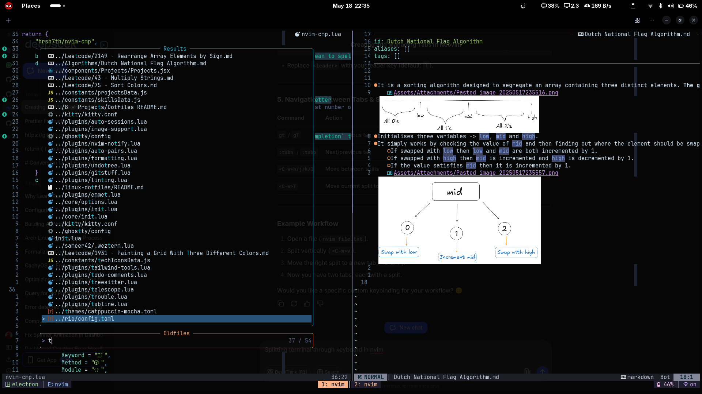

# Contents

<!-- toc -->

- [Overview](#overview)
- [Follow me on social media](#follow-me-on-social-media)

<!-- tocstop -->

## Overview
- This is the dotfiles repo where I keep my system configuration.
- My daily driver OS is Arch Linux (Endeavour OS) and my editor of choice is Neovim.
- Sneak peek of my setup below:

## Follow me on social media
- [GitHub](https://github.com/sameer240704)
- [LinkedIn](https://www.linkedin.com/in/sameergupta24/)
- [Twitter](https://x.com/SameerGupt348)
